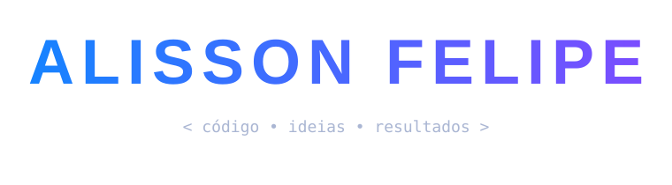
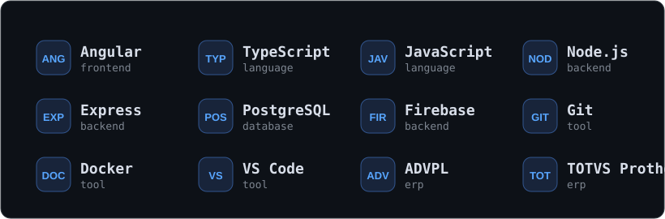
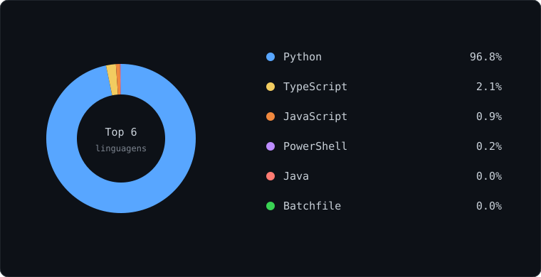

  

<table>
<tr>
<td width="34%" valign="top">

</td>
<td width="66%" valign="top">

### `alisson@github:~$ whoami`

**Alisson Felipe**  
Full-Stack Developer · Web · ADVPL / TOTVS Protheus  
Brasil 🇧🇷

### `alisson@github:~$ ./stack-map.sh`

### `alisson@github:~$ ./contributions.sh`

### `alisson@github:~$ ./lang-stats.sh`

</td>
</tr>
</table>

> Desenvolvimento web, sistemas empresariais e automação — transformando requisitos em soluções úteis.

---

<code>DTO &gt; CÓDIGO &gt; EVOLUÇÃO</code>

